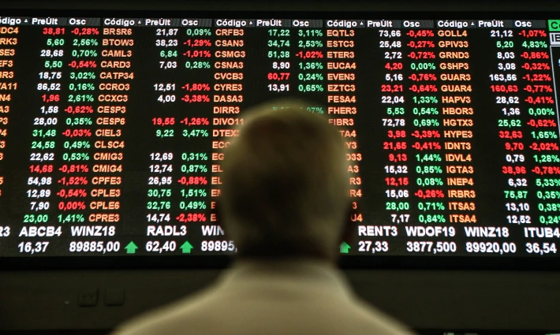
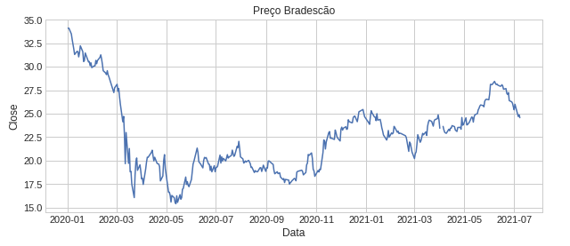
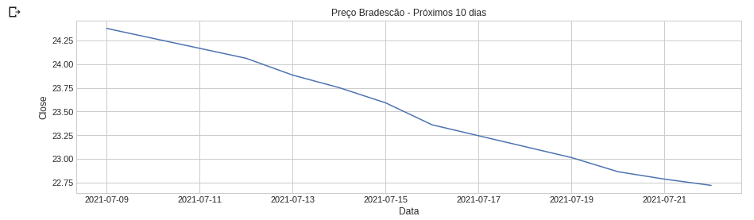

## Previsão de Preços com Regressão Logística



### Bem vindo novamente!

Neste artigo vou mostrar como você pode, com apenas nove blocos de um notebook do Google Colab, coletar dados, montar uma base de dados, processar a informação, gerar gráficos e ainda rodar um modelo de Machine Learning simples, elegante, prático, fácil..

A biblioteca que utilizei para gerar o algorítmo foi a [AutoTS](https://thecleverprogrammer.com/2021/04/19/autots-in-python-tutorial/), para séries temporais. O link da *lib* voce encontra [aqui](https://pypi.org/project/AutoTS/).

Vamos lá!

### Instalação das bibliotecas

As duas bibliotecas abaixo por padrão não vem instaladas, caso seja necessário, execute os comandos **um de cada vez**.

```
!pip install yfinance
```
```
!pip install autots
```

### Importação das bibliotecas

```
import numpy as np
import pandas as pd
import matplotlib.pyplot as plt
import seaborn as sns
import yfinance as yf
from seaborn import regression
sns.set()
plt.style.use('seaborn-whitegrid')
import warnings
warnings.filterwarnings("ignore")
```

### Escolha do ativo

Caso não saiba o nome do *ticker* da ação, você deve acessar o site do [Yahoo Finance](https://finance.yahoo.com/) para buscar o código dela na B3. Geramente o código é acompanhado de **'.SA'**. Por exemplo: o *ticker* da Vale na bolsa brasileira é negociado como **VALE3.SA**. 

```
# Selecione a ação:
acao = 'BBDC4.SA'
```
```
# Esse código vai fazer a coleta de dados
previsao = yf.download(acao, start='2020-01-01')
```

As datas serão importantes para que o algorítmo possa realizar os cálculos das previsões, porém como elas vem indexadas do site do Yahoo Finance precisamos transforma-lás em uma coluna (variável). Também aproveitamos para limpar dados faltantes:

```
previsao['Data'] = previsao.index
previsao.dropna()
previsao.tail(3)
```

Agora, você *códa* um gráfico do comportamento do preço da ação selecionada até a data de hoje:

```
# Plotando o gráfico desde o início de 2020
plt.figure(figsize=(20, 4))
plt.title("Preço Bradescão")
plt.xlabel("Data")
plt.ylabel("Close")
plt.plot(previsao["Close"])
plt.show();
```


### Feito isso, a próxima etapa é a de modelagem dos dados e previsão dos preços:

As linhas de código do bloco abaixo farão a seleção das colunas necessárias, a limpeza de mais de +200 datas do passado, a previsão dos preçospara os próximos 10 dias e ainda disponibilizará essas informações em um dataset para plotagem de um novo gráfico. Esse código na minha máquina levou 4 minutos para rodar..

```
from autots import AutoTS # biblioteca do algorítmo
model = AutoTS(forecast_length=10, frequency='infer', ensemble='simple', drop_data_older_than_periods=200)
model = model.fit(previsao, date_col='Data', value_col='Close', id_col=None)

# Modelo de Regressão Logística:
prediction = model.predict()
forecast = prediction.forecast
```

Depois de executado, o código abaixo mostrará o resultado gerado em forma de tabela dos três últimos dias e processará a coluna *data* para plotagem do gráfico:

```
forecast['Data'] = forecast.index
forecast.tail(3) # pode colocar os 10 dias caso queira ver apenas em tabela
```

Agora o gráfico das previsões:

```
# Gráfico dos próximos 10 dias a ação de acordo com o algorítmo
plt.figure(figsize=(20, 8))
plt.title(f"Preço do papel {acao} - próximos 10 dias")
plt.xlabel("Data")
plt.ylabel("Close")
plt.plot(forecast["Close"])
plt.show();
```



Pronto, realemnte é só isso!
E aí, vai comprar, vender, arriscar umas opções, montar uma trava?

Vai confiar no resultado do seu algorítmo? rsrs

Por hoje é isso. *Se gostou, clique no botão curtir, ative o sinin..* não, espera aí..

Neste [link](https://share.streamlit.io/joaovictordds/fincancas_mf/main/app.py) mostro como fiz uma simulação Monte Carlo para prever 10 preços diferentes para os próximos 50 dias de ações *Blue Chips* da B3. E aqui você pode acessar outros projetos do meu [portfolio](https://joaovictordds.github.io/Portfolio/).

Obrigado

*postado em 08/07/2021.*
*fonte da imagem: Werther Santana/Estadão*
